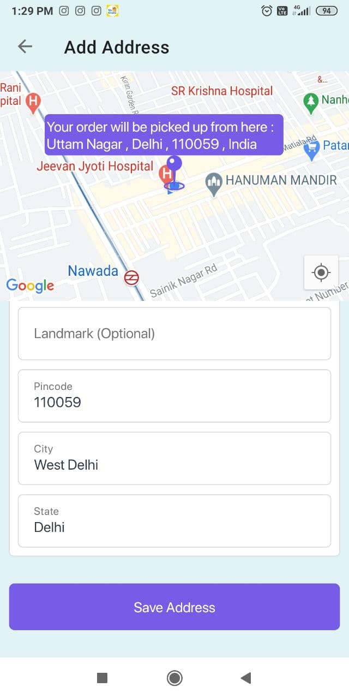
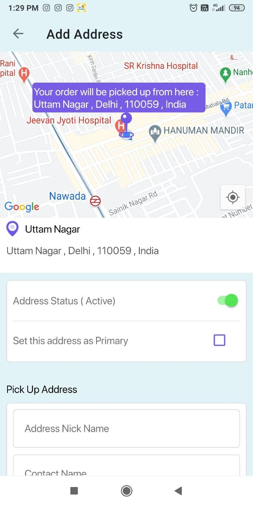
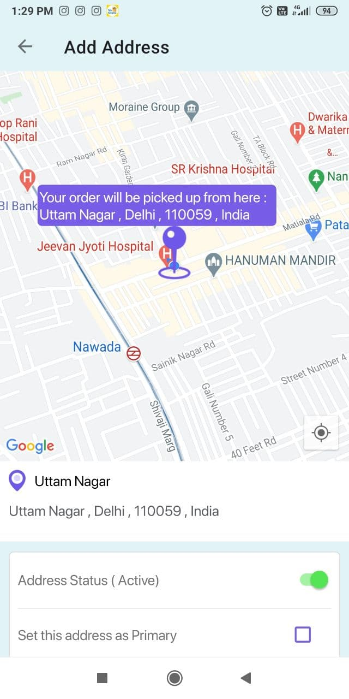

# MapWithCoordinatorLayout
Google map with coordinator layout and bottom sheet behaviour like swiggy 

Some days ago , I was handed over with a UI Design which kind of looked like how swiggy implements its add address screen . 
I found a lot of good article on Google map , coordinator layout and Bottom sheet behaviour . 
With all of this combined I was able to implement the screen as per the design wireframe . 

All suggestions and improvements are most welcome :)
Hope it helps someone !!

   

 

